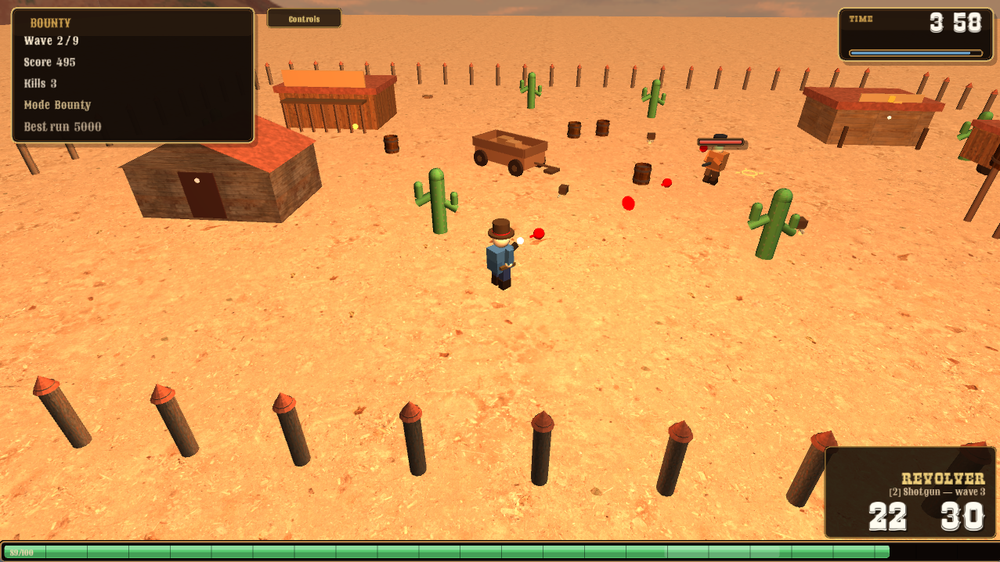
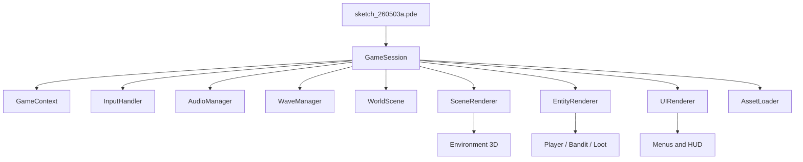

# A Man with No Name 

A 3D western arena shooter built with [Processing](https://processing.org/) (P3D) for **SEN3301** — Spring 2025–26.

Survive wave after wave of bandits in a dusty frontier town. Manage ammo, grab loot, and beat the clock in Story or Endless mode.

> **Team:**   
> *Yavuzhan Özbek - 2201927*  
> Ozan Halis Demiralp - 2203046

<p align="center">
  
</p>

---

## Quick start

1. Install [Processing 4.x](https://processing.org/download)
2. Open `sketch_260503a/` in the IDE
3. Press **Run** ▶

Fullscreen vs windowed is read from `data/progression.txt` on launch. Toggle in **Settings** from the title screen.

Full controls and win/lose rules → `[GAME_RULES.md](GAME_RULES.md)`

---

## Features

- **Story & Endless modes** — 9-wave campaign or infinite scaling
- **Three weapons** — Revolver, Shotgun, Repeater (progressive unlocks in Story)
- **Smart enemies** — bandits pathfind around buildings and shoot back
- **Western arena** — textured buildings, barrels, cacti, cubemap sky
- **Persistent progress** — high score, kills, audio & display prefs saved locally

---

## Architecture

The sketch uses a thin entry point that delegates to a **GameSession** orchestrator. Shared state lives in **GameContext**; rendering, input, audio, and waves are split into dedicated managers.




| Layer            | Role                                             |
| ---------------- | ------------------------------------------------ |
| `GameSession`    | Main loop, combat, camera, session flow          |
| `WorldScene`     | Colliders, grid pathfinding, movement resolution |
| `WaveManager`    | Spawns, wave breaks, win/lose conditions         |
| `SceneRenderer`  | Sky, terrain, buildings, textured primitives     |
| `EntityRenderer` | Player, bandits, ground loot                     |
| `UIRenderer`     | Title, settings, HUD, overlays                   |
| `AudioManager`   | WAV SFX + looping menu / in-game music           |


Entity classes own **logic and state**; draw code is routed through renderers where practical.

---

## Under the hood

A few systems worth noting — kept simple on purpose, but real enough to matter in gameplay.

### Pathfinding (A*)

Bandits navigate a **100-unit grid** over the arena. Walkability is derived from building/barrel/cactus colliders. Paths refresh periodically and bandits steer toward waypoints while strafing near the player.

### Aim & camera

Mouse position is unprojected through the **perspective camera** onto the ground plane (`y = 0`) so shooting and player facing follow the cursor. The camera orbits with **RMB drag** and zooms with the **mouse wheel**.

### Collisions

- **Circle vs AABB / circle** colliders for player, enemies, and bullets
- **Grid-based walkability** for spawn placement and AI
- Arena bounds clamp movement at the fence line

### Waves & difficulty

Enemies spawn in **staggered groups** with preview markers. Wave size scales gently (2–6 bandits in Story). HP and speed creep up per wave; Endless mode ramps further after wave 9.

### Particles & FX

`GameParticle` base class drives muzzle flashes, shell casings, hit sparks, gore chunks, and HUD floaters. Each particle updates life and renders in the play loop.

### Audio

All sounds are **WAV** via `SoundHelper.java` (javax.sound.sampled). Menu music ducks during wave breaks; in-game theme pauses on **ESC**.

---

## Project layout

```
processing-3d-game/
├── README.md                 ← you are here
├── GAME_RULES.md             ← controls, scoring, modes
├── LICENSE
└── sketch_260503a/
    ├── sketch_260503a.pde    ← entry point (~50 lines)
    ├── WesternGameSession.pde
    ├── WesternGameContext.pde
    ├── WesternGameWorld.pde      … colliders + A*
    ├── WesternGameWaves.pde      … wave logic
    ├── WesternGameSceneRenderer.pde
    ├── WesternGameEntityView.pde
    ├── WesternGameUI.pde
    ├── WesternGameEntities.pde   … Player, Bandit, loot
    ├── WesternGameFx.pde
    ├── WesternGameAudio.pde
    ├── WesternGameInput.pde
    ├── WesternGameCombat.pde
    ├── WesternGameAssets.pde
    ├── SoundHelper.java
    └── data/                     … textures, sounds, fonts, UI
```

Asset checklist → `[sketch_260503a/data/ASSET_LIST.md](sketch_260503a/data/ASSET_LIST.md)`

---

## SEN3301 checklist


| Requirement           | How it's covered                               |
| --------------------- | ---------------------------------------------- |
| 3D game               | P3D renderer, full 3D arena                    |
| Adaptable display     | Fullscreen toggle + resizable window           |
| Background            | Cubemap / procedural sky                       |
| ≥ 3 moving characters | Bandit AI with pathfinding                     |
| Keyboard + mouse      | WASD, shoot, weapon keys, camera               |
| Camera rotate & zoom  | RMB + mouse wheel                              |
| Texture mapping       | Cylinders (barrels, cacti), cones (fence caps) |
| Score & time          | HUD + `progression.txt` high score             |
| OOP structure         | Session, managers, entities, renderers         |
| End conditions        | Time over, death, wave clear, quit key         |


---

## License

MIT — see `[LICENSE](LICENSE)`.